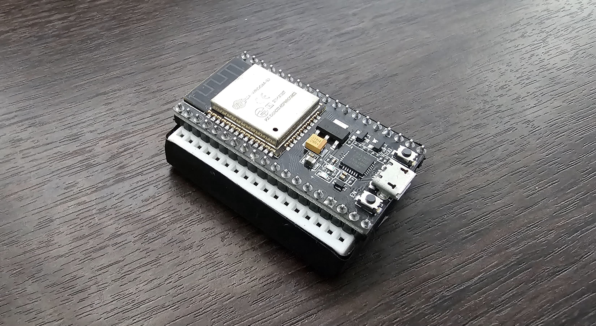
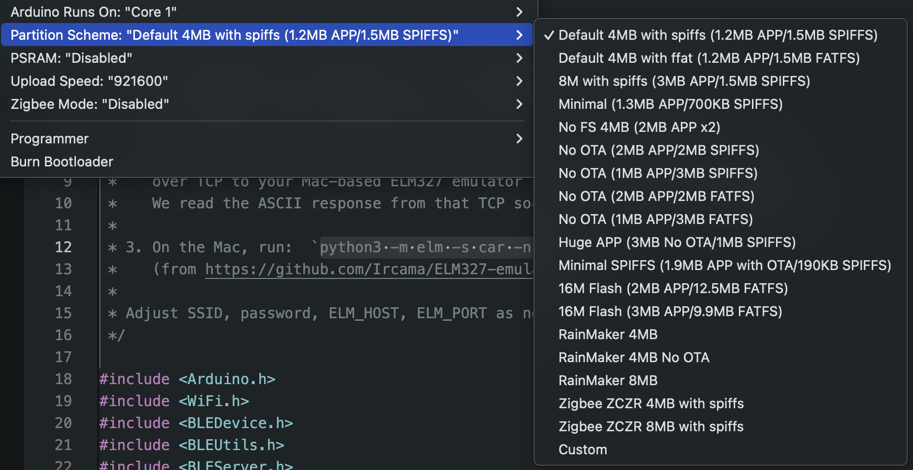

# ELM327 ESP32 Ble Emulator

The goal of this project is to emulate the functionality of a BLE ELM327 dongle. The ECU logic isn't contained in this project, this just acts as a real ELM327, passing through the information from car's ECU to client end.



## ELM327Emu

This folder contains my own BLE ELM327 emulator, it makes use of Ircama ELM327 for emulate the ECU properly. It depends on that implementation and for you to run it prior on your machine.

## Requirements

You need an ESP32 dev board. I'm using a ESP-WROOM-32.

### Steps to run the emulator

1. Install locally the ELM327 Ircama emulator: https://github.com/Ircama/ELM327-emulator
2. Start the emulator running the following command: ```python3 -m elm -s car -n 35000```
3. Optionally, on the CMD terminal execute ```loglevel debug``` in order to watch incoming commands.
4. Before compiling, set the Partition Scheme of your ESP32 to "Default 4MB with spiffs (1.2MB APP/1.5MB SPIFFS)" this is due the codebase exceeds the default partition scheme of the ESP32.
5. Restart/Start the ESP32 with the ELM327Emu.ino code already compiled.
6. Open Android Bluetooth native options or nRF Connect app and bond the ESP32 BLE Device. Password is 123456.
7. Open CarScanner, configure BLE 4.0 and select the ESP32 BLE Device.
8. In CarScanner press connect.

### Setup Partition Scheme

Go to: Arduino IDE -> Tools -> Partition Scheme



---

## Disclaimer

This project is licensed under the MIT License. See the [LICENSE](LICENSE) file for more details.