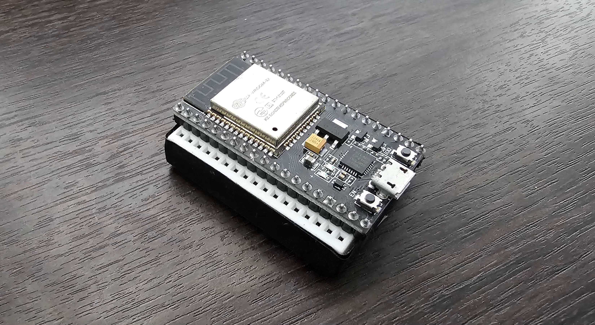
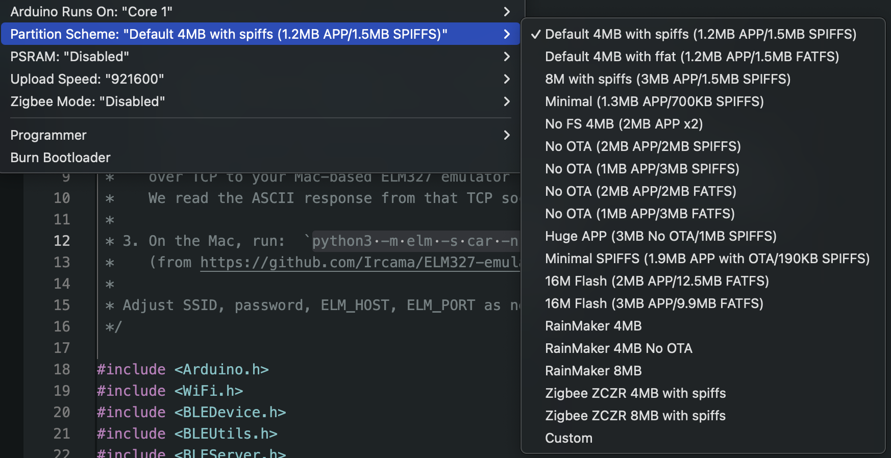

# ESP32 BLE ELM327 Emulator

A debugging and interception tool that emulates an ELM327 OBD-II adapter using an ESP32. Designed for reverse engineering OBD-II app communications, bridging to ECU emulators, and learning automotive diagnostic protocols.



## What It Does

The ESP32 acts as a **transparent bridge** between OBD-II diagnostic apps and an ECU emulator (Ircama). It exposes three simultaneous communication interfaces:

| Interface | Protocol | Compatible Apps |
|-----------|----------|----------------|
| **BLE 0xAE00** | Custom GATT | mechanical-assistant (custom app) |
| **BLE 0xFFF0** | Standard OBD-II BLE | CarScanner, Torque BLE, OBD Fusion |
| **BT Classic SPP** | Serial Port Profile | Torque (classic), older Android apps |

All interfaces share the same processing pipeline:

```
App (BLE/BT/Serial)
    |
    v
[Command Logger]  ← Records everything for reverse engineering
    |
    v
[AT Dispatcher]   ← Local response or forward to emulator?
    |
    v
[TCP Bridge]      ← Ircama ELM327-emulator (Python, port 35000)
    |
    v
[Response]        ← Back to app via same interface
```

## Key Features

### Command Sniffer (Reverse Engineering)
Every command and response is logged with timestamps and source interface:

```
[1234ms] BLE/FFF0  APP> "ATZ"    | LOCAL< "ELM327 v1.5 [EMU]"
[1567ms] BLE/FFF0  APP> "010C"   | EMU< "41 0C 1A F8"
[2100ms] BT_SPP    APP> "ATSP0"  | EMU< "OK"
```

Use `AT+LOG_DUMP` to retrieve the full session log via BLE and `AT+LOG_CLEAR` to reset it.

### Hybrid AT Command Handling
- **Bridge mode** (WiFi connected): Commands are forwarded to the Ircama emulator
- **Standalone mode** (WiFi disconnected): ESP32 responds locally with `[EMU]` suffix
- Apps see `"ELM327 v1.5"` (bridge) or `"ELM327 v1.5 [EMU]"` (standalone)

### Reliability
- MTU negotiation (up to 512+ bytes per BLE packet on modern phones)
- TCP reconnection with exponential backoff (500ms, 1s, 2s)
- Per-command-type timeouts (AT: 2s, PID: 5s, multi-frame: 10s)
- Hardware watchdog timer (30s) and heap monitoring (every 60s)
- Fixed char buffers instead of Arduino String (no heap fragmentation)

## Hardware Requirements

**ESP32-WROOM-32** is the **only** option. It's the only ESP32 variant that supports both Bluetooth Classic SPP and BLE simultaneously.

| Feature | ESP32-WROOM-32 | ESP32-S3 | ESP32-C3 |
|---------|:-:|:-:|:-:|
| BLE | 4.2 | 5.0 | 5.0 |
| **BT Classic SPP** | **YES** | NO | NO |
| WiFi | b/g/n | b/g/n | b/g/n |
| CAN/TWAI | Built-in | Built-in | Built-in |
| RAM | 520KB | 512KB | 400KB |

## Setup

### 1. Install Ircama ELM327 Emulator

```bash
pip install ELM327-emulator
# Or clone: git clone https://github.com/Ircama/ELM327-emulator
```

### 2. Start the Emulator

```bash
python3 -m elm -s car -n 35000
# Optional: type 'loglevel debug' in the emulator prompt
```

### 3. Configure the ESP32

Copy the config template and fill in your values:

```bash
cp config.h.example config.h
```

Edit `config.h`:

```c
#define WIFI_SSID     "YourNetworkName"
#define WIFI_PASSWORD "YourPassword"
#define ELM_HOST      "192.168.1.100"  // IP of machine running Ircama
#define ELM_PORT      35000
#define BLE_PASSKEY   123456
#define BLE_DEVICE_NAME "ESP32-ELM327-Emu"
#define BT_CLASSIC_NAME "OBDII"
```

### 4. Flash the Firmware

1. Open `ELM327Emu.ino` in Arduino IDE
2. Set board: **ESP-WROOM-32**
3. Set Partition Scheme: **"Default 4MB with spiffs (1.2MB APP/1.5MB SPIFFS)"**
4. Compile and upload



### 5. Connect an App

**BLE (CarScanner, Torque BLE):**
1. The ESP32 advertises with standard UUID `0xFFF0`
2. Most BLE OBD apps auto-detect it
3. Select the device and connect

**Bluetooth Classic (Torque classic, older apps):**
1. Go to Android Bluetooth settings
2. Pair with "OBDII" (or your configured BT_CLASSIC_NAME)
3. Open your OBD app and select the paired device

**USB Serial (testing/debugging):**
1. Connect ESP32 via USB
2. Open serial monitor at 115200 baud
3. Type commands directly (e.g., `ATZ`, `010C`)

## Architecture

### File Structure

```
elm327-esp32-ble-emu/
├── ELM327Emu.ino          # Main firmware (~350 lines)
├── config.h.example       # Configuration template
├── config.h               # Your config (gitignored)
├── at_handler.h           # AT command dispatcher (local vs forward)
├── cmd_logger.h           # Command sniffer/logger (circular buffer)
├── bt_classic.h           # Bluetooth Classic SPP interface
├── ROADMAP.md             # Development roadmap
├── LICENSE                # MIT License
├── .gitignore
├── assets/
│   ├── esp32.jpeg
│   └── partition_scheme.png
├── docs/
│   └── FUTURE_CAN_BUS.md  # Future CAN bus upgrade documentation
└── tests/
    └── esp32_serial_test.py  # Automated serial test harness
```

### AT Command Dispatcher

The ELM327 has ~60 AT commands. The dispatcher categorizes them:

| Category | Commands | Behavior |
|----------|----------|----------|
| **Local** | ATE0/1, ATH0/1, ATL0/1, ATS0/1, ATM0/1, ATI, AT@1, ATRV, ATZ | Handled on ESP32, update local state |
| **Forward** | ATSP, ATDP, ATSH, ATCRA, ATCAF, ATCFC, etc. | Forwarded to Ircama via TCP |
| **Pass-through** | 01xx, 02xx, 03xx, 09xx... | OBD queries forwarded as-is |
| **Special** | AT+LOG_DUMP, AT+LOG_CLEAR | Custom commands for sniffer |

In **hybrid mode**: Local commands always update ESP32 state, but are also forwarded to Ircama when TCP is available. When TCP is unavailable, local responses include `[EMU]` suffix.

### Command Logger

The sniffer stores the last 200 command/response pairs in a circular buffer with:
- Millisecond timestamp
- Source interface (BLE/AE00, BLE/FFF0, BT_SPP, SERIAL)
- Command sent by app
- Response (and whether it was local or from emulator)

This is the key feature for reverse engineering OBD-II apps.

## Testing

### Serial Test Harness

Test the ESP32 firmware via USB serial (no BLE required):

```bash
cd tests/

# Auto-detect ESP32 port
python3 esp32_serial_test.py

# Specific port
python3 esp32_serial_test.py /dev/ttyUSB0

# Standalone mode (no Ircama needed)
python3 esp32_serial_test.py --standalone
```

Requires `pyserial`:

```bash
pip install pyserial
```

## Serial Monitor Output

When running, the ESP32 outputs to Serial (115200 baud):

```
============================================
  ESP32 BLE ELM327 Emulator v2.0
  Debugging & Interception Tool
============================================
[WiFi] Connected! IP: 192.168.1.50
[BT_SPP] Bluetooth Classic SPP started as "OBDII"
--------------------------------------------
  BLE Device:    ESP32-ELM327-Emu
  BLE Custom:    0xAE00 (mechanical-assistant)
  BLE Standard:  0xFFF0 (CarScanner/Torque)
  BT Classic:    OBDII (SPP)
  WiFi:          Connected
  ELM Emulator:  192.168.1.100:35000
  Free heap:     245000 bytes
--------------------------------------------
Ready. Send commands via BLE, BT Classic, or Serial.

[BLE] Central connected
[BLE] MTU negotiated: 517 (chunk size: 514)
[1234ms] BLE/FFF0  APP> "ATZ"      | EMU< "ELM327 v1.5"
[1567ms] BLE/FFF0  APP> "ATSP0"    | EMU< "OK"
[1890ms] BLE/FFF0  APP> "010C"     | EMU< "41 0C 1A F8"
[SYS] Free heap: 240000 bytes | Min free: 235000 bytes
```

## Troubleshooting

### ESP32 doesn't appear in Bluetooth scan
- Make sure the firmware compiled with the correct partition scheme
- Check serial output for "Advertising restarted" messages
- Some phones cache old BLE scan results — toggle Bluetooth off/on

### "NO TCP" responses
- Verify Ircama is running: `python3 -m elm -s car -n 35000`
- Check WiFi connection in serial output
- Verify `ELM_HOST` IP in config.h matches Ircama machine
- ESP32 will retry 3 times with exponential backoff

### CarScanner / Torque doesn't detect the device
- CarScanner: Look for BLE 4.0 devices, the ESP32 advertises UUID 0xFFF0
- Torque: Use Bluetooth Classic connection (pair "OBDII" in Android settings first)
- Some apps require a specific device name — try changing `BT_CLASSIC_NAME` to "OBDII"

### Heap warnings in serial output
- Normal heap with all services: ~240-250KB free
- If heap drops below 50KB, consider reducing `CMD_LOG_MAX_ENTRIES` in cmd_logger.h
- The firmware uses fixed buffers (no String) to prevent fragmentation

## Future Upgrades

- **CAN Bus Interface**: Physical CAN connection via built-in TWAI + TJA1050 transceiver. See [docs/FUTURE_CAN_BUS.md](docs/FUTURE_CAN_BUS.md)
- **Standalone PIDs**: Embedded PID table with preset scenarios (no Ircama needed)
- **NVS Configuration**: Persistent settings stored in ESP32 flash, configurable via BLE
- **Web Dashboard**: HTTP server on ESP32 showing live status and intercepted commands
- **OTA Updates**: Over-the-air firmware updates

See [ROADMAP.md](ROADMAP.md) for the complete development plan.

## License

MIT License. See [LICENSE](LICENSE).
